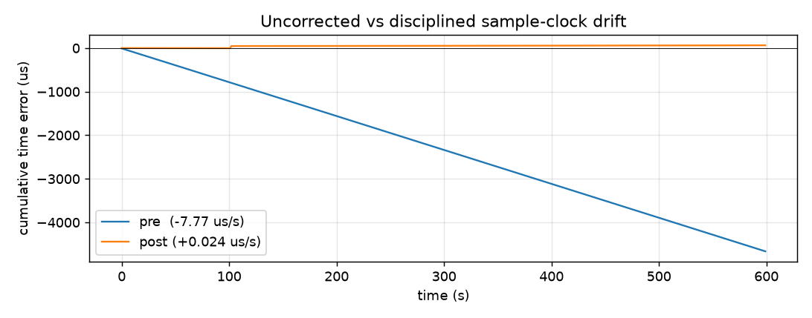

# pps_counter metrics — sample-clock discipline, before / after

Stability of the AD936x **sample clock** vs GPS, measured by the `pps_counter`
hardware PPS latch ([`PPS_DELTA`](../README.md) = sample-clock counts per GPS
second), before and after the [`xo_correct.sh`](../xo_correct.sh) discipline loop.

## Results (600 GPS seconds each)

| Metric | Pre-correction | Post-correction |
|---|---|---|
| Mean frequency offset | **−7.773 ppm** | **+0.024 ppm** |
| Time-error drift rate | **−7.77 µs/s** (−672 ms/day) | **+0.024 µs/s** (+2.1 ms/day) |
| Cumulative time error / 10 min | **−4664 µs** | **+63 µs** |
| Frequency stability (std) | 0.019 ppm | 0.031 ppm |
| Per-second jitter (p2p) | 3 cnt / 98 ns | 6 cnt / 195 ns |
| Allan dev @1 s / longest τ | 1.7e‑8 / 6.5e‑9 | 1.9e‑8 / 1.3e‑8 |
| Re-tune relock transients | 0 | 1 |

Disciplining nulls the sample-clock offset and converts an **unbounded
−672 ms/day drift into a bounded ±tens-of-µs hold**, for ~1 count more per-second
jitter and a brief relock glitch per correction (the lone +49 ppm spike). The
classic GPSDO trade.



See [`NOTES.md`](NOTES.md) for method, plant characterization, the other figures,
and the re-tune-transient caveat.

## Workflow

Requires the `--hwlatch` bitstream (PPS on F20; otherwise `PPS_DELTA` reads 0).
Host needs python + numpy + matplotlib; the device side is pure `sh` + `devmem`.

```sh
# 1. baseline (xo_correction off): capture 600 PPS edges
ssh root@pluto.local 'sh -s 600' < capture_pps_delta.sh > data/baseline_precorrection.csv

# 2. corrected: capture 600 edges while disciplining (one cooperative loop)
ssh root@pluto.local 'sh -s 600' < capture_and_correct.sh > data/corrected_postcorrection.csv

# 3. per-run figures + the before/after overlay
python analyze.py data/baseline_precorrection.csv --label "pre-correction" --prefix baseline
python compare.py data/baseline_precorrection.csv data/corrected_postcorrection.csv
```

## Files

| File | Role |
|---|---|
| [`capture_pps_delta.sh`](capture_pps_delta.sh) | device: log `pps_seq,pps_delta` per GPS second |
| [`capture_and_correct.sh`](capture_and_correct.sh) | device: same capture + discipline `xo_correction` inline |
| [`analyze.py`](analyze.py) | host: stats + 4 single-run figures for one CSV |
| [`compare.py`](compare.py) | host: before/after table + overlay figures |
| `data/` | the two captured CSVs (+ baseline stats) |
| `figures/` | generated PNGs (`baseline_*`, `compare_*`) |
| [`NOTES.md`](NOTES.md) | method, characterization, per-figure detail, caveats |

The disciplining loop itself ([`../xo_correct.sh`](../xo_correct.sh)) is shipped
into the firmware as an init script on `--hwlatch` builds — it autostarts after a
PPS lock.
