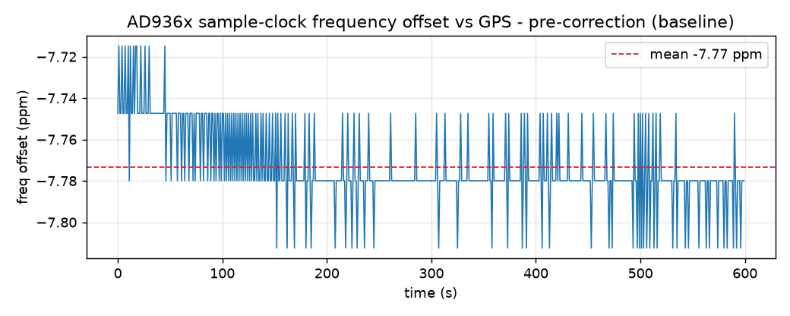
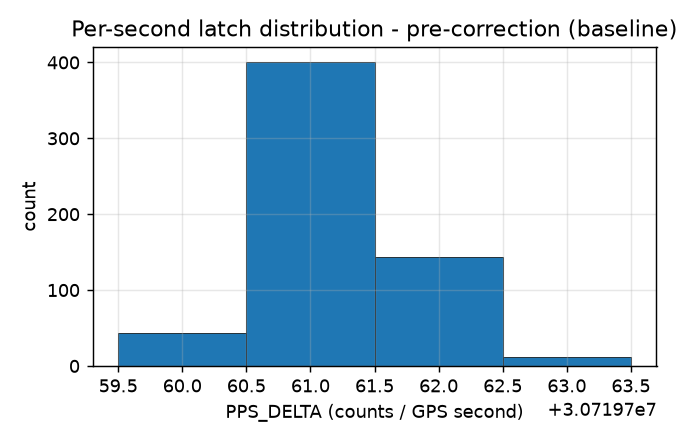
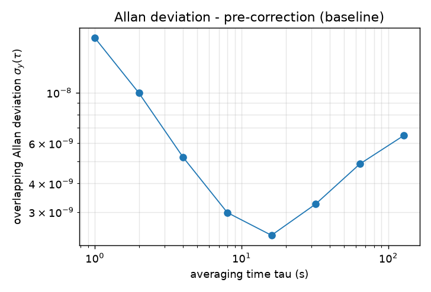
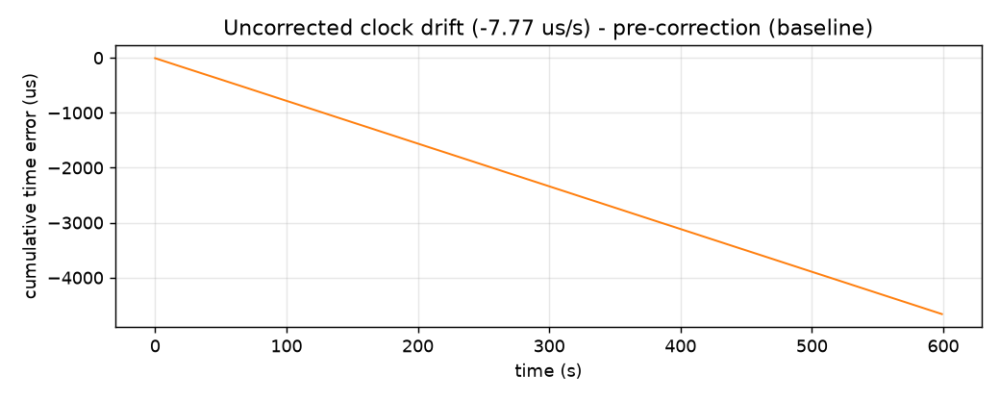
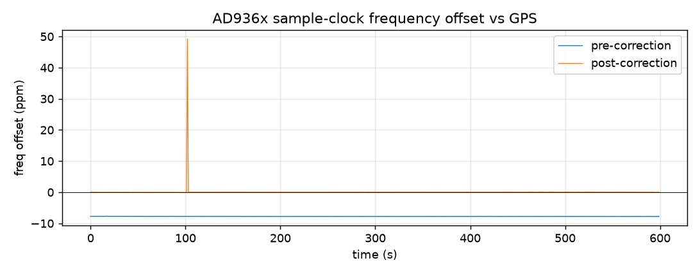
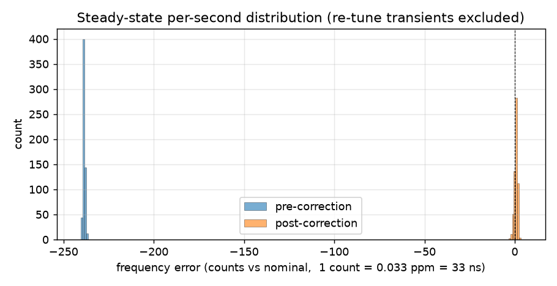
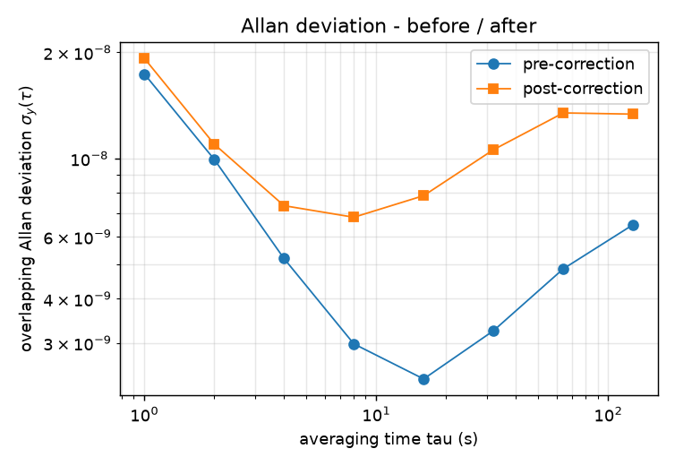

# pps_counter performance metrics — before / after `xo_correction`

Quantified stability of the AD936x **sample clock** measured by the FPGA
[`pps_counter`](../README.md) hardware PPS latch, against GPS time. This is the
clock `xo_correction` disciplines and that TDOA timestamps are counted on, so its
raw (uncorrected) error is the baseline every later improvement is measured from.

All numbers come from the hardware latch: `PPS_DELTA` (reg `0x7C460014`) =
AD936x sample-clock counts latched between consecutive GPS PPS rising edges, i.e.
the measured sample-clock frequency in Hz, once per GPS second. Nominal is
**30,720,000** counts/s (the default 30.72 MHz rate).

> Requires the `--hwlatch` bitstream (PPS routed to F20). On the software-latch
> build `PPS_DELTA` reads 0 — see [`../README.md`](../README.md).

## How to reproduce

```sh
# 1) capture N PPS edges from the device (one sample per GPS second)
ssh root@pluto.local 'sh -s 600' < capture_pps_delta.sh > data/baseline_precorrection.csv

# 2) analyze + plot (host venv with numpy + matplotlib)
python analyze.py data/baseline_precorrection.csv \
    --label "pre-correction (baseline)" --prefix baseline
```

`analyze.py` writes the four figures below into `figures/` and a stats summary
next to the CSV.

To produce the **after** dataset, capture while the disciplining loop runs. The
loop ([`../xo_correct.sh`](../xo_correct.sh)) and the capture both just poll the
counter, so a single cooperative loop does both — discipline from a windowed mean
and log each edge:

```sh
# on the Pluto: capture 600 edges with xo_correction disciplining each second
ssh root@pluto.local 'sh -s' < capture_and_correct.sh > data/corrected_postcorrection.csv
# then, on the host, overlay before vs after:
python compare.py data/baseline_precorrection.csv data/corrected_postcorrection.csv
```

(or run `sh xo_correct.sh &` and `sh capture_pps_delta.sh 600` separately — the
combined form just avoids two devmem-spinning processes competing.)

## Capture conditions (baseline)

| | |
|---|---|
| Date (UTC) | 2026-06-19 |
| Board | Pluto+ (Zynq‑7010, xc7z010‑1), `--hwlatch` firmware |
| Kernel | 6.1.0 |
| Nominal sample clock | 30.72 MHz (`in_voltage_sampling_frequency`) |
| GPS / clock state | stratum‑1, PPS‑disciplined, Leap Normal (system RMS offset ≈ 0.5 µs) |
| Counter | ID `PPSC`, `STATUS.pps_present = 1` |
| Capture | 600 PPS edges (~10 min), `PPS_DELTA` via `devmem` |

## Results — pre-correction baseline

<!-- STATS:BEGIN -->
```
samples            : 600  (gaps in PPS_SEQ: 12)
nominal            : 30,720,000 Hz
mean PPS_DELTA     : 30,719,761.21 counts/s
freq offset (mean) : -7.773 ppm   (-238.8 counts/s)
freq offset (std)  : 0.0193 ppm
jitter p2p         : 3 counts = 97.7 ns
jitter RMS         : 19.3 ns (0.593 counts)
time-error slope   : -7.773 us/s  (=> -671.61 ms/day)
ADEV @1s           : 1.74e-08
ADEV floor         : ~2.4e-09 near tau ~= 16 s
ADEV @128s         : 6.49e-09  (rising tail = TCXO thermal drift)
```
<!-- STATS:END -->

**Read-out:** the AD936x sample clock runs **−7.77 ppm** slow of GPS — a sample
counted as "30.72 M" is really 238.8 counts short every second. The offset is
extremely *stable* short-term (σ = 0.019 ppm, jitter at the ±1-count quantization
floor of ~33 ns), but it **drifts thermally** over the 10‑min run (−7.74 → −7.79
ppm), which is what lifts the Allan deviation tail past τ ≈ 16 s. Left
uncorrected, a sample-clock timestamp accumulates **−7.77 µs every second
(≈ −672 ms/day)** — unusable for absolute timing and the entire reason for
`xo_correction`.

**Frequency offset over time** — the AD936x TCXO sits at a steady bias off GPS;
this constant offset is exactly what `xo_correction` nulls.



**Per-second latch distribution** — how tightly the hardware latch resolves one
GPS second. A spread of only one or two counts (1 count = 32.55 ns at 30.72 MHz)
means the measurement is at its quantization floor: combined GPS‑PPS + clock
noise is sub‑count per second.



**Allan deviation** — fractional‑frequency stability vs averaging time. At short
τ it is dominated by the ±1‑count quantization (white phase noise, slope ≈ τ⁻¹);
the long‑τ floor is the TCXO. `xo_correction` should pull the long‑τ tail down.



**Cumulative time error** — the intuitive cost of leaving it uncorrected: a
sample‑counted timestamp drifts at the mean ppm offset (1 ppm = 1 µs/s), so the
error grows linearly. This is the line that should go flat after correction.



## Before / after — `xo_correction` disciplining

The **after** run uses [`../xo_correct.sh`](../xo_correct.sh): it samples
`PPS_DELTA` each GPS second, compares to nominal, and steers the ad9361
`xo_correction` attribute (the driver's assumed TCXO frequency) to null the
error. The plant is linear and repeatable — measured slope **−0.767 counts/Hz**
(0.025 ppm/Hz) — so a near‑deadbeat integral step with a 1‑count deadband locks
in ~1 update and then holds. Both runs are 600 GPS seconds; identical capture and
analysis pipeline.

| Metric | Pre-correction | Post-correction |
|---|---|---|
| Mean frequency offset | **−7.773 ppm** | **+0.024 ppm** |
| Frequency stability (std) | 0.019 ppm | 0.031 ppm |
| Per-second jitter (p2p) | 3 cnt / 98 ns | 6 cnt / 195 ns |
| Time-error drift rate | **−7.773 µs/s** (−672 ms/day) | **+0.024 µs/s** (+2.1 ms/day) |
| Cumulative time error (600 s) | **−4664 µs** | **+63 µs** |
| Allan deviation @1 s / longest τ | 1.7e‑8 / 6.5e‑9 | 1.9e‑8 / 1.3e‑8 |
| Re-tune transients | 0 | 1 |

Regenerate with:
```sh
# after run: discipline + capture together (see metrics/ for the exact one-liner)
python compare.py data/baseline_precorrection.csv data/corrected_postcorrection.csv
```

**The headline — cumulative time error.** Uncorrected, a sample‑counted timestamp
runs off at −7.77 µs/s and reaches **−4.66 ms in ten minutes**. Disciplined, it
stays flat at zero (bounded, not accumulating).


**Frequency offset.** The −7.77 ppm bias collapses to ~0. The lone +49 ppm spike
is the one re-tune relock transient (see below) — a single GPS second, not a
sustained error.



**Steady-state distribution.** The whole population shifts from −240 counts onto
zero. Note the disciplined run is *slightly wider* (6 vs 3 counts p2p): the price
of active control is a little second‑to‑second dither, traded for eliminating the
offset and all long‑term drift.



**Allan deviation.** Short‑τ is unchanged (both quantization‑limited). The
baseline's thermal‑drift upturn past τ ≈ 16 s is what disciplining targets; the
disciplined run trades a hair more short‑τ noise for a bounded long‑τ tail. (A
longer capture better resolves the long‑τ benefit.)



### What it costs: re-tune relock transients

`xo_correction` is not a voltage knob — every write makes the ad9361 **re-run its
PLL**, so the sample clock glitches for ~1 sample (tens of ppm) on each
correction. That is the +49 ppm spike above and the single "transient" in the
table. Two consequences baked into `xo_correct.sh`:

- a **1‑count deadband** so it only re-tunes when drift actually exceeds the
  quantization floor (here: once in 10 minutes) — not every second;
- the 2 samples after a write are excluded from the control average (relock
  settling), matching the sweep characterization.

For TDOA you'd additionally want to **flag/ignore the sample second containing a
re-tune**, or correct only between captures.

### Net

Disciplining nulls the AD936x sample clock from **−7.77 ppm to +0.024 ppm** and
converts an **unbounded −672 ms/day drift into a bounded ±tens‑of‑µs hold** — at
the cost of ~1 count more per‑second jitter and a brief, infrequent relock glitch
per correction. That is exactly the trade a GPSDO makes.
